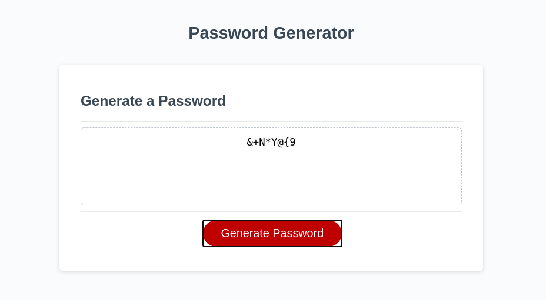

# [Password Generator](https://logner.github.io/pwd-gen)

A simple password generator that asks for inputs in the form of prompts.

Generates a password between 8 and 128 characters in length.

The script generates a large list of desired characters, and randomly picks from the list to generate the password. These desired characters are validated via prompts by the user. I made a reusable hex class to make this automation easier.

This is the Week 3 Assignment for the University of Toronto School of Continuing Studies Bootcamp. An empty-ish javascript called script.js was provided. index.html and style.css were also provided.

